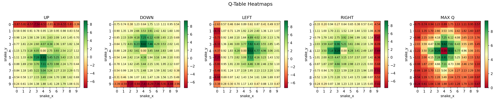
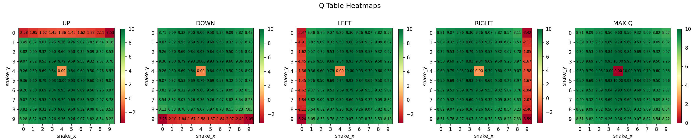
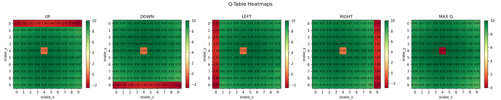

# Q-Learning Snake 🐍

Tabular Q-Learning agent that learns to navigate a 10×10 grid toward a fixed fruit while avoiding collisions.

## Setup

- **Grid:** 10×10
- **Fruit:** Fixed at (4, 4)
- **Snake:** Random spawn each episode, single cell (no growth)
- **Actions:** UP, DOWN, LEFT, RIGHT

## How It Works

### Reward

$$R(s) = \text{normalize}\Big(\text{maxDist} - d_{\text{euclidean}}(\text{snake},\ \text{fruit})\Big) + \text{Fruit}(+10) + \text{Collision}(-10)$$

### Q-Update (Bellman)

$$Q(s, a) \leftarrow Q(s, a) + \alpha \Big[ r + \gamma \max_{a'} Q(s', a') - Q(s, a) \Big]$$

| Param | Value |
|-------|-------|
| α (learning rate) | 0.1 |
| γ (discount) | 0.9 |

### Exploration / Exploitation

**Exploration** — ε-greedy with linear decay across all 10,000 episodes:

$$\varepsilon = \max\Big(\varepsilon_{\min},\ \varepsilon_{\text{start}} - (\varepsilon_{\text{start}} - \varepsilon_{\min}) \cdot \frac{\text{episode}}{\text{maxEpisodes}}\Big)$$

**Exploitation** — softmax over Q-values rather than pure argmax:

$$P(a) = \frac{e^{Q(s,a)}}{\sum_{a'} e^{Q(s,a')}}$$

This lets the agent still occasionally pick suboptimal actions during exploitation, keeping behavior less brittle.

## Results

### Episode 500

Early training — Q-values are noisy, agent is still mostly exploring.

**Q-Table**

---

### Episode 5,000

Mid training — clear gradient forming toward the fruit at (4, 4).

**Q-Table**

---

### Episode 10,000

Final — agent has learned a strong value gradient. Cells closer to the fruit have higher Q-values, and each directional heatmap shows the agent preferring the action that moves it toward (4, 4).

**Q-Table**

## Next Steps

- **Use WebSockets**: Instead of requests, I will be using raw websockets for faster communication and probably UDP protocol.
- **Better Reward Function:** Reward_v2 = tanh( -1 * euc_dist(snake, fruit)) + Collision(-10)
- **Deep Q-Network (DQN):** Replace Q-table with a CNN, add replay buffer and target network
- **Growing snake:** Full snake game with body growth and self-collision
- **Random fruit:** Fruit spawns at random positions each episode
- **Snake Velocity:** Snake will automatically be moving without giving input
